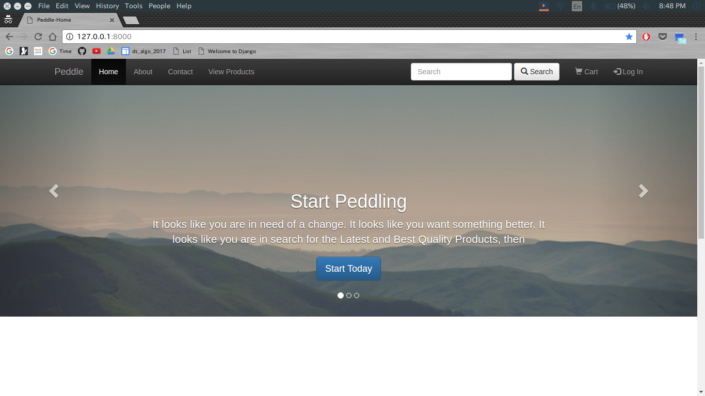
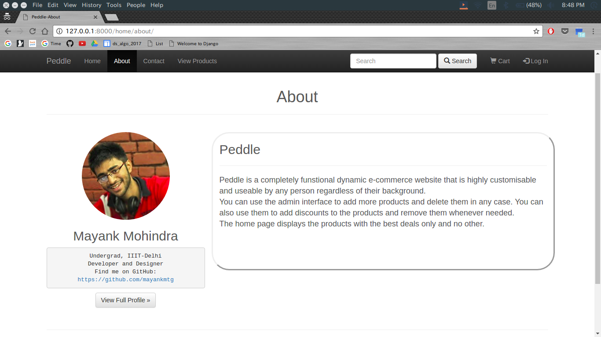
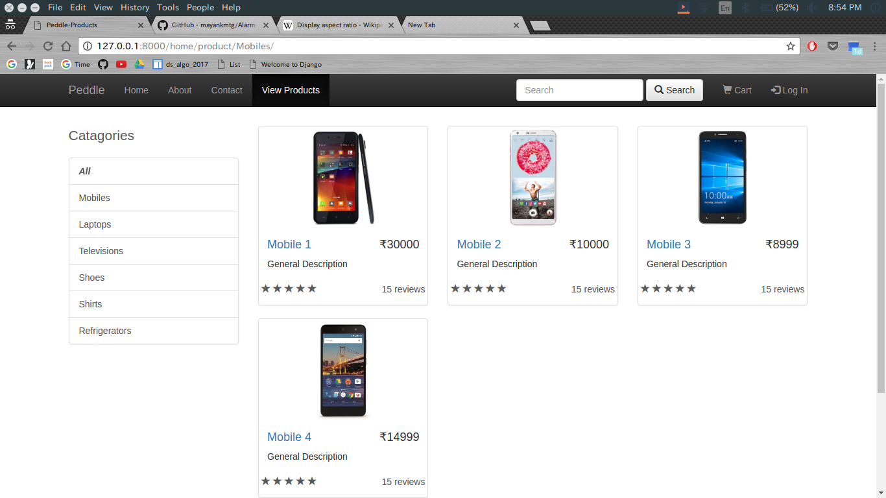
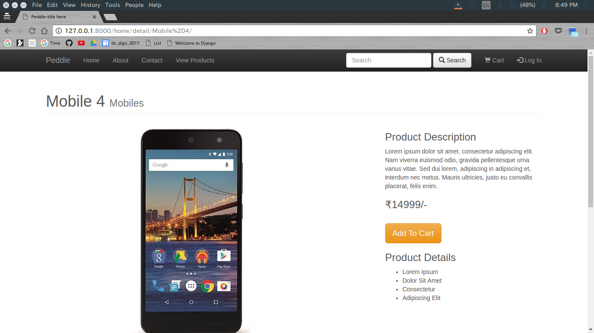
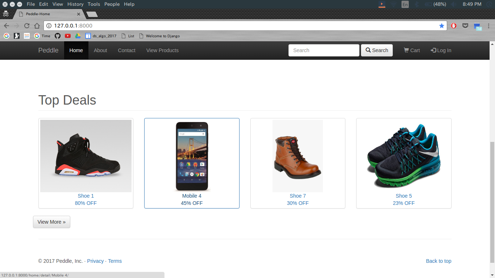

# Peddle
Dynamic E-Commerce website template developed in DJANGO.

Aim
----------
The main aim of the project is to get an insight of using DJANGO and its components and also to understand the basics of dynamic web-development.

What does the Product do?
----------
The product can be customised into any of e-commerce website and its updation and maintainance is also very easy.

Technologies Used
----------
- HTML
- CSS
- Javascript
- Django
- Python

ScreenShots
----------
 

 

How is this Helpful?
----------
The site can be used as a Template to any DJANGO project, including both the very minimal ones like About pages, and also the complicated ones involving numerous lists and details.

Front-End Credits
----------
- BOOTSTRAP- Getting Started
- STARTBOTSTRAP.com